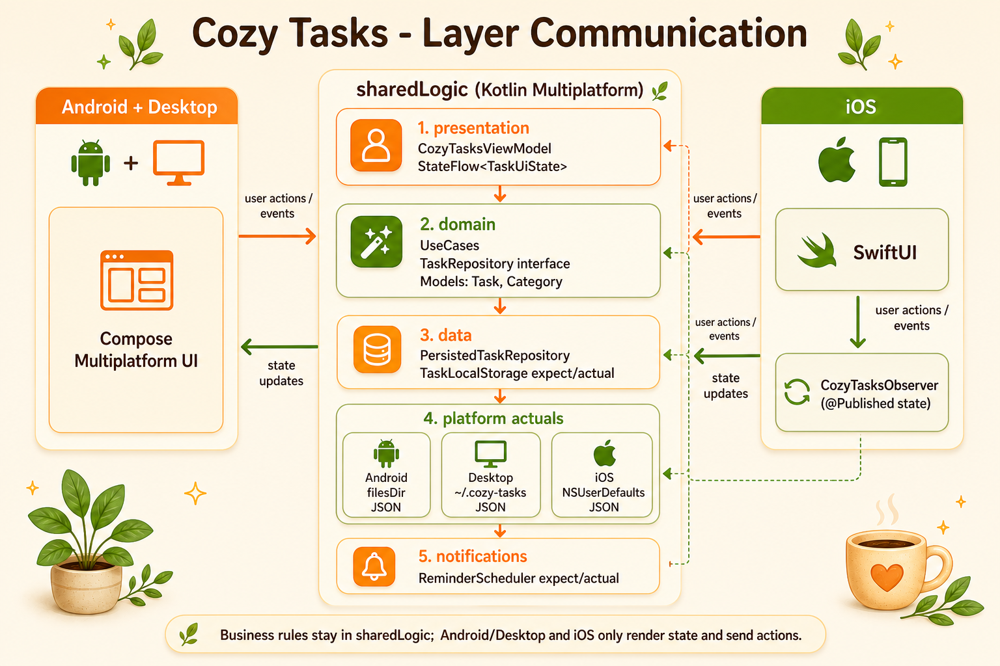

# Cozy Tasks

Cozy Tasks is a Kotlin Multiplatform TODO list and activity manager with shared business logic, Compose Multiplatform UI for Android/Desktop, and native SwiftUI for iOS.

The visual direction follows a cozy style: warm cream backgrounds, orange and green accents, soft cards, rounded surfaces, light borders, and small plant details.

## Architecture



Detailed architecture docs:

- [English architecture documentation](docs/en_US/ARCH.md)
- [Portuguese architecture documentation](docs/pt_BR/ARCH.md)

The app keeps task rules, state, filtering, summaries, persistence, and organization inside `sharedLogic`. Android/Desktop and iOS only render state and send user actions.

```text
Android/Desktop Compose UI
        |
        v
sharedLogic CozyTasksViewModel
        ^
        |
iOS SwiftUI -> CozyTasksObserver
```

## Modules

- `sharedLogic`: shared Clean Architecture core written in Kotlin Multiplatform.
- `sharedUI`: Compose Multiplatform UI used by Android and Desktop.
- `androidApp`: Android entry point.
- `desktopApp`: Desktop JVM entry point.
- `iosApp`: native SwiftUI app that observes the shared Kotlin ViewModel.

## Shared Logic Layers

Path:

`sharedLogic/src/commonMain/kotlin/com/valternegreiros/cozy_todo_task`

- `domain/models`: `Task`, `Category`, `ChecklistItem`, `TaskPriority`, `TaskFilter`, `TaskStatus`.
- `domain/repository`: `TaskRepository` interface.
- `domain/usecases`: CRUD, toggle, observe, and filtering rules.
- `data/repository`: `PersistedTaskRepository`.
- `data/local`: multiplatform local storage abstraction with `expect/actual`.
- `presentation/viewmodels`: shared `CozyTasksViewModel`.
- `presentation/state`: `TaskUiState`, task draft, dashboard summary, and settings state.
- `presentation/actions`: UI action/event model.
- `core/theme`: cozy design tokens.
- `core/dispatchers`, `core/result`, `core/time`, `core/i18n`: platform-neutral utilities.
- `notifications`: `ReminderScheduler` `expect/actual` placeholders for future local reminders.

## UI Architecture

### Android and Desktop

Android and Desktop use Compose Multiplatform from `sharedUI`.

Main files:

- `sharedUI/src/commonMain/kotlin/com/valternegreiros/cozy_todo_task/App.kt`
- `sharedUI/src/commonMain/kotlin/com/valternegreiros/cozy_todo_task/ui/screens/CozyTasksScreen.kt`
- `sharedUI/src/commonMain/kotlin/com/valternegreiros/cozy_todo_task/ui/components/*`
- `sharedUI/src/commonMain/kotlin/com/valternegreiros/cozy_todo_task/ui/theme/CozyPalette.kt`

Compose collects the shared state:

```kotlin
val state by viewModel.uiState.collectAsState()
```

Then it renders `CozyTasksScreen(state, viewModel)`.

### iOS

iOS uses native SwiftUI.

Main files:

- `iosApp/iosApp/ContentView.swift`
- `iosApp/iosApp/ViewModels/CozyTasksObserver.swift`
- `iosApp/iosApp/Views/*`
- `iosApp/iosApp/Components/*`
- `iosApp/iosApp/Theme/CozyColor.swift`

Swift imports the Kotlin framework generated by KMP:

```swift
import SharedLogic
```

`CozyTasksObserver` owns the shared Kotlin `CozyTasksViewModel`, observes its state, and publishes it to SwiftUI:

```swift
@Published var state: TaskUiState
```

SwiftUI renders this state and sends actions back through the observer.

## iOS and Kotlin Communication

The `sharedLogic` Gradle configuration generates an iOS framework named `SharedLogic`:

```kotlin
iosTarget.binaries.framework {
    baseName = "SharedLogic"
    isStatic = true
}
```

That is why Swift can use:

```swift
import SharedLogic
```

The iOS flow is:

```text
SwiftUI screen
  -> CozyTasksObserver
  -> CozyTasksViewModel Kotlin
  -> UseCases
  -> TaskRepository
  -> TaskLocalStorage actual
  -> StateFlow<TaskUiState>
  -> observeState callback
  -> @Published state
  -> SwiftUI redraw
```

## Persistence

The app uses a JSON snapshot encoded with Kotlinx Serialization behind a shared `TaskLocalStorage` abstraction.

- Android: writes `cozy_tasks_store.json` in `Context.filesDir`.
- Desktop: writes `~/.cozy-tasks/cozy_tasks_store.json`.
- iOS: stores the JSON string in `NSUserDefaults`.

This keeps the app lightweight, easy to inspect, and fully multiplatform without adding database setup. SQLDelight or a multiplatform DataStore layer can replace `TaskLocalStorage` later without changing ViewModels or use cases.

## Features

- Dashboard greeting and daily summary.
- Pending, completed, overdue, and today counters.
- Task list with create, edit, delete, complete, and uncomplete.
- Priority, category, due date, notes, and optional checklist draft.
- Filters for all, today, upcoming, completed, overdue, priority, and category.
- Settings toggles for theme, notifications, and completion sound.
- Shared ViewModel used by Compose and SwiftUI.
- SwiftUI renders shared state and dispatches actions to the shared ViewModel.
- i18n structure prepared for English, Brazilian Portuguese, and Spanish.
- Reminder scheduling architecture prepared with `expect/actual`.

## Running

Android:

```bash
./gradlew :androidApp:assembleDebug
```

Desktop:

```bash
./gradlew :desktopApp:run
```

iOS:

Open `iosApp` in Xcode and run the `iosApp` scheme.

The Xcode project runs the Kotlin framework embedding task through a build phase:

```bash
./gradlew :sharedLogic:embedAndSignAppleFrameworkForXcode
```

This task is normally executed by Xcode with the required Apple build environment variables.

## Useful Gradle Tasks

List shared logic tasks:

```bash
./gradlew :sharedLogic:tasks --all
```

Compile shared JVM and Compose UI:

```bash
./gradlew :sharedLogic:compileKotlinJvm :sharedUI:compileKotlinJvm
```

Compile Android:

```bash
./gradlew :androidApp:assembleDebug
```

Compile Desktop:

```bash
./gradlew :desktopApp:compileKotlin
```

Compile iOS simulator shared framework:

```bash
./gradlew :sharedLogic:compileKotlinIosSimulatorArm64
```

Run shared JVM tests:

```bash
./gradlew :sharedLogic:jvmTest
```
